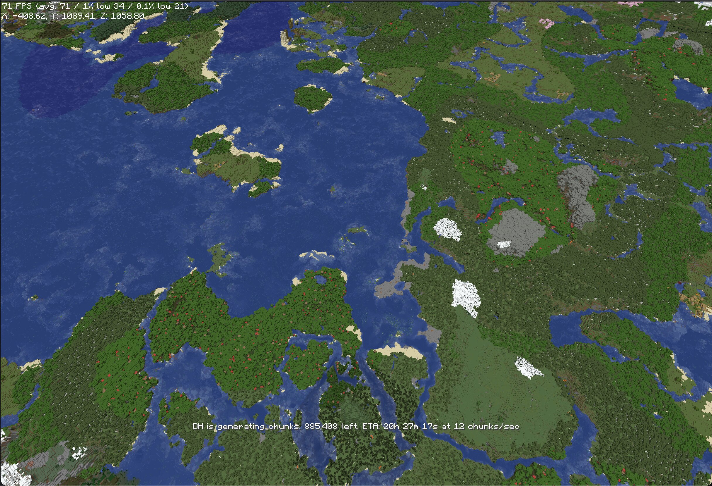

# Distant Horizons — VulkanMod Port

A fork of [Distant Horizons](https://gitlab.com/distant-horizons-team/distant-horizons) with native **Vulkan rendering** via [VulkanMod](https://github.com/xCollateral/VulkanMod).

LODs are rendered using VulkanMod's Vulkan pipeline instead of OpenGL, enabling Distant Horizons to work on systems and configurations running VulkanMod.


*Distant Horizons LODs rendered via VulkanMod's Vulkan backend (MC 1.21.11)*

## Status

### ✅ Working
- LOD terrain rendering with correct colors and vertex format
- Lightmap support (day/night cycle, block light)
- Depth integration (LODs render behind MC terrain)
- Transparency / alpha blending (water, glass, etc.)
- Ambient occlusion (SSAO)
- Distance and height fog (all falloff types and mixing modes)
- Noise / dithering on LODs
- Fade / clip distance transitions

### ⚠️ Not Yet Implemented
- **Shader pack support** — VulkanMod does not support shader packs (Iris/OptiFine)
- **Earth curvature rendering**
- **Wireframe debug mode**
- **Cloud rendering** to LOD distance

See [docs/vulkan_implementation_roadmap.md](docs/vulkan_implementation_roadmap.md) for the full technical roadmap.

## Requirements

- **Minecraft:** 1.21.11
- **Mod loader:** Fabric
- **VulkanMod** must be installed
- **DH base version:** 2.4.6

> This is not the official Distant Horizons mod. For the original, see the [GitLab](https://gitlab.com/distant-horizons-team/distant-horizons) or [CurseForge](https://www.curseforge.com/minecraft/mc-mods/distant-horizons) pages.

## Building

```bash
./gradlew :fabric:build -PmcVer="1.21.11"
```

The compiled jar will be in `fabric/build/libs/`.

## Source Code Setup

### Prerequisites

* JDK 17 or newer — https://www.oracle.com/java/technologies/downloads/
* Git — https://git-scm.com/

### IntelliJ IDEA
1. Install the Manifold plugin
2. Open IDEA and import the `build.gradle`
3. Refresh the Gradle project if required

### Other commands

```bash
./gradlew --refresh-dependencies   # refresh dependencies
./gradlew clean                    # delete compiled code
./gradlew genSources               # generate MC source for browsing
./gradlew fabric:runClient         # run Fabric client (debugging)
```

> Source code uses Mojang mappings & [Parchment](https://parchmentmc.org/) mappings.

## Open Source Acknowledgements

- [Forgix](https://github.com/PacifistMC/Forgix) — jar merging
- [LZ4 for Java](https://github.com/lz4/lz4-java) — data compression
- [NightConfig](https://github.com/TheElectronWill/night-config) — JSON & TOML config handling
- [sqlite-jdbc](https://github.com/xerial/sqlite-jdbc) — SQLite driver
