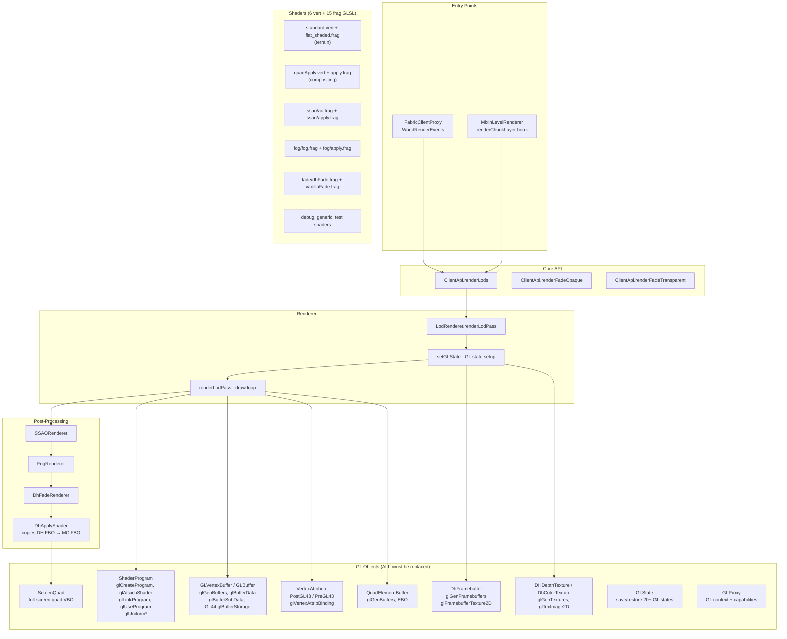
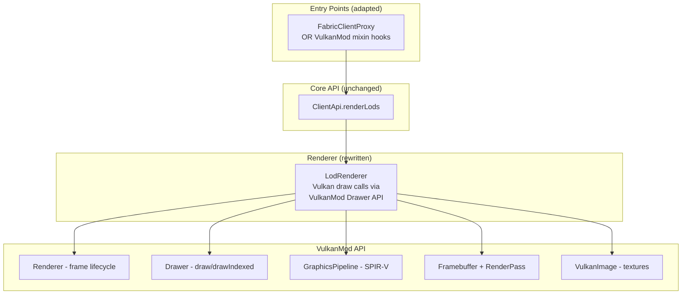

# Distant Horizons → VulkanMod Port: Full Implementation Plan

**Target:** MC 1.21.11 · Fabric-only · VulkanMod as rendering backend

---

## Architecture Overview

### Current DH Rendering Pipeline



### Target Architecture



---

## Complete GL Surface Inventory

### `IMinecraftGLWrapper` Interface (21 methods)

| Method | GL Call | VulkanMod Equivalent |
|--------|---------|---------------------|
| `enableScissorTest()` | `glEnable(SCISSOR_TEST)` | `PipelineState` / `Renderer.setScissor()` |
| `disableScissorTest()` | `glDisable(SCISSOR_TEST)` | `Renderer.resetScissor()` |
| `enableDepthTest()` | `glEnable(DEPTH_TEST)` | `PipelineState.depthState` |
| `disableDepthTest()` | `glDisable(DEPTH_TEST)` | `PipelineState.depthState` |
| `glDepthFunc(int)` | `glDepthFunc` | `PipelineState.depthState` |
| `enableDepthMask()` | `glDepthMask(true)` | `PipelineState.depthState` |
| `disableDepthMask()` | `glDepthMask(false)` | `PipelineState.depthState` |
| `enableBlend()` | `glEnable(BLEND)` | `PipelineState.blendState` |
| `disableBlend()` | `glDisable(BLEND)` | `PipelineState.blendState` |
| `glBlendFunc(int,int)` | `glBlendFunc` | `PipelineState.blendState` |
| `glBlendFuncSeparate(...)` | `glBlendFuncSeparate` | `PipelineState.blendState` |
| `glBindFramebuffer(int,int)` | `glBindFramebuffer` | VulkanMod `Framebuffer` / `RenderPass` |
| `glGenBuffers()` | `glGenBuffers` | `Buffer` allocation |
| `glDeleteBuffers(int)` | `glDeleteBuffers` | `Buffer.freeBuffer()` |
| `enableFaceCulling()` | `glEnable(CULL_FACE)` | `PipelineState.cullState` |
| `disableFaceCulling()` | `glDisable(CULL_FACE)` | `PipelineState.cullState` |
| `glGenTextures()` | `glGenTextures` | `VulkanImage.createTextureImage()` |
| `glDeleteTextures(int)` | `glDeleteTextures` | `VulkanImage.free()` |
| `glActiveTexture(int)` | `glActiveTexture` | `VTextureSelector` |
| `getActiveTexture()` | query `TEXTURE_BINDING_2D` | Track internally |
| `glBindTexture(int)` | `glBindTexture` | `VTextureSelector.bindTexture()` |

### `IMinecraftRenderWrapper` Interface (19 methods)

Most are **non-GL queries** (camera position, FOV, fog color, etc.) and remain unchanged. The GL-specific ones are:

| Method | Concern | Strategy |
|--------|---------|----------|
| `getTargetFramebuffer()` | Returns GL FBO ID | Return VulkanMod framebuffer handle |
| `getDepthTextureId()` | Returns GL texture ID | Return VulkanMod depth image handle |
| `getColorTextureId()` | Returns GL texture ID | Return VulkanMod color image handle |
| `mcRendersToFrameBuffer()` | GL query | Always true under VulkanMod |
| `runningLegacyOpenGL()` | GL version check | Always return false |

### Core GL Object Classes (21 files to modify/replace)

| File | Lines | GL Calls | Priority |
|------|-------|----------|----------|
| `GLProxy` | 450 | GL context creation, capabilities query | P0 - Replace with VulkanMod capability check |
| `GLState` | 260 | Save/restore 20+ GL states via `glGet*` | P0 - No-op or remove (Vulkan uses pipeline objects) |
| `GLBuffer` | 345 | `glGenBuffers`, `glBufferData/SubData/Storage`, `glBind/Delete` | P0 - Replace with VulkanMod `Buffer` |
| `GLVertexBuffer` | 88 | Extends `GLBuffer`, `GL_ARRAY_BUFFER` target | P0 - Replace with VulkanMod vertex buffer |
| `GLElementBuffer` | ~50 | Extends `GLBuffer`, `GL_ELEMENT_ARRAY_BUFFER` target | P0 - Replace with VulkanMod index buffer |
| `QuadElementBuffer` | ~80 | Pre-generated quad index buffer | P0 - Replace |
| `ShaderProgram` | 231 | `glCreateProgram`, `glAttachShader`, `glLinkProgram`, `glUseProgram`, `glUniform*` | P0 - Replace with `GraphicsPipeline` + push constants |
| `Shader` | ~60 | `glCreateShader`, `glShaderSource`, `glCompileShader` | P0 - Replace with `SPIRVUtils` compilation |
| `DhFramebuffer` | 154 | `glGenFramebuffers`, `glFramebufferTexture2D`, `glBindFramebuffer`, `glCheckFramebufferStatus` | P0 - Replace with VulkanMod `Framebuffer` |
| `DHDepthTexture` | ~80 | `glGenTextures`, `glTexImage2D` (DEPTH32F) | P0 - Replace with `VulkanImage` |
| `DhColorTexture` | ~100 | `glGenTextures`, `glTexImage2D` (RGBA8) | P0 - Replace with `VulkanImage` |
| `VertexAttributePostGL43` | ~80 | `glCreateVertexArrays`, `glVertexAttribFormat/Binding` | P0 - Replace with `VertexFormat` definition |
| `VertexAttributePreGL43` | ~80 | `glVertexAttribPointer` (legacy path) | P0 - Remove (Vulkan only needs format def) |
| `ScreenQuad` | ~50 | Full-screen quad VBO for post-processing | P1 - Replace with VulkanMod full-screen draw |
| `DhTerrainShaderProgram` | 227 | Extends `ShaderProgram`, defines vertex format, uniforms | P0 - Rewrite for Vulkan pipeline |
| `DhApplyShader` | 199 | Compositing shader, bind textures, draw quad | P1 - Rewrite |
| `SSAOShader/SSAOApplyShader` | ~200 | FBO + texture creation, multi-pass | P2 - Rewrite or disable initially |
| `FogShader/FogApplyShader` | ~200 | Same pattern as SSAO | P2 - Rewrite or disable initially |
| `DhFadeShader/VanillaFadeShader` | ~200 | Fade blending | P2 - Rewrite or disable initially |
| `AbstractShaderRenderer` | ~80 | Base for all post-process shaders | P1 - Rewrite base class |

### GLSL Shaders (6 vertex + 15 fragment)

All must be either converted to SPIR-V or rewritten:

**Vertex shaders:** `standard.vert`, `quadApply.vert`, `debug/vert.vert`, `genericObject/direct/vert.vert`, `genericObject/instanced/vert.vert`, `test/vert.vert`

**Fragment shaders:** `flat_shaded.frag`, `apply.frag`, `fade/apply.frag`, `fade/dhFade.frag`, `fade/vanillaFade.frag`, `fog/fog.frag`, `fog/apply.frag`, `ssao/ao.frag`, `ssao/apply.frag`, `noise/noise.frag`, `debug/frag.frag`, `genericObject/direct/frag.frag`, `genericObject/instanced/frag.frag`, `test/dark.frag`, `test/frag.frag`

### Direct GL32 Calls in Renderers (outside GLMC wrapper)

`LodRenderer` and post-processing renderers also call GL32 directly:
- `GL32.glPolygonMode()` — wireframe debug
- `GL32.glDisable(GL_SCISSOR_TEST)` 
- `GL32.glViewport()`
- `GL32.glClearDepth()`, `GL32.glClearColor()`, `GL32.glClear()`
- `GL32.glBlendEquation()`
- `GL32.glDrawElements()`
- `GL32.glGetFramebufferAttachmentParameteri()`
- `GL32.glTexImage2D()`, `GL32.glTexParameteri()`
- `GL32.glFramebufferTexture()`
- `GL32.glUniform1i()`

---

## Strategic Decision: Two Approaches

> [!IMPORTANT]
> **Key insight:** VulkanMod already provides a **GL compatibility shim layer** (`VkGlBuffer`, `VkGlTexture`, `VkGlFramebuffer`, `VkGlProgram`, `VkGlShader`) that translates GL calls to Vulkan. DH's `IMinecraftGLWrapper` calls flow through MC's `GlStateManager`, which VulkanMod already intercepts via mixins.
>
> This gives us **two strategic approaches:**

### Approach A: Leverage VulkanMod's GL Shim (Faster, Riskier)

VulkanMod's mixin layer already intercepts most GL calls and translates them to Vulkan. DH's rendering *might work partially out of the box* if VulkanMod's shim covers all the GL calls DH makes.

**Pros:** Less code to write. Faster path to "something renders on screen."
**Cons:** DH makes many direct `GL32.*` calls that bypass `GlStateManager` — VulkanMod's shim won't intercept those. `GLState` save/restore bypasses the shim entirely. SSAO/Fog framebuffers use raw GL. Performance may be poor.

**Verdict:** Partial viability. Many DH calls go directly to `GL32` and won't be intercepted.

### Approach B: Native VulkanMod Backend (Correct, More Work)

Replace all GL objects with VulkanMod-native equivalents. Create `GraphicsPipeline` for each shader pair, use `Drawer` for draw calls, `VulkanImage` for textures, VulkanMod `Framebuffer` for FBOs.

**Pros:** Correct, performant, maintainable.
**Cons:** Significant upfront work. All 21 GL object classes need Vulkan equivalents.

> [!CAUTION]
> **Recommended: Hybrid approach.** Start with Approach A to get the basic pipeline rendering (will catch ~60% of calls via VulkanMod's shim), then progressively replace direct GL32 calls with VulkanMod-native equivalents. This gives fastest path to visible results.

---

## Proposed Changes

### Phase 0: Build Cleanup & Mod Compat Stripping

**Goal:** Fabric-only build targeting MC 1.21.11, all mod compat code removed.

---

#### [MODIFY] [settings.gradle](file:///Users/sebastian/IdeaProjects/distant-horizons-vulkanmod/settings.gradle)

- Remove Forge/NeoForge plugin repositories and subproject iteration
- Hardcode Fabric-only build

#### [MODIFY] [build.gradle](file:///Users/sebastian/IdeaProjects/distant-horizons-vulkanmod/build.gradle)

- Remove all `forge`/`neoforge` conditional blocks and configurations
- Strip Architectury Loom plugin (Forge-only)

#### [MODIFY] [fabric/build.gradle](file:///Users/sebastian/IdeaProjects/distant-horizons-vulkanmod/fabric/build.gradle)

- Remove all Sodium/Iris/Optifine/Canvas/BCLib/Starlight dependencies
- Add VulkanMod JAR as `modCompileOnly`

#### [MODIFY] [1.21.11.properties](file:///Users/sebastian/IdeaProjects/distant-horizons-vulkanmod/versionProperties/1.21.11.properties)

- Set `builds_for=fabric`
- Set all `enable_*=0`

#### [DELETE] `forge/`, `neoforge/` directories

#### [MODIFY] [FabricMain.java](file:///Users/sebastian/IdeaProjects/distant-horizons-vulkanmod/fabric/src/main/java/com/seibel/distanthorizons/fabric/FabricMain.java)

- Gut `initializeModCompat()` — remove Sodium, Iris, Indium checks
- Remove `runDelayedSetup()` Sodium fog occlusion toggle

#### [DELETE] All mod accessor implementations:
- [SodiumAccessor.java](file:///Users/sebastian/IdeaProjects/distant-horizons-vulkanmod/fabric/src/main/java/com/seibel/distanthorizons/fabric/wrappers/modAccessor/SodiumAccessor.java)
- [IrisAccessor.java](file:///Users/sebastian/IdeaProjects/distant-horizons-vulkanmod/fabric/src/main/java/com/seibel/distanthorizons/fabric/wrappers/modAccessor/IrisAccessor.java) (and others in that directory)

#### Core subproject mod accessor cleanup:
- Remove/stub `ISodiumAccessor`, `IIrisAccessor`, `IOptifineAccessor`, `AbstractOptifineAccessor`  
- Remove Iris-specific code in `LodRenderer` (lines using `IRIS_ACCESSOR`)
- Remove Optifine-specific framebuffer logic in `LodRenderer.createRenderObjects()`

---

### Phase 1: VulkanMod GL Shim Assessment & Initial Integration

**Goal:** Determine what renders out-of-the-box with VulkanMod's GL compatibility layer, fix the critical gaps.

---

#### Investigation Steps

1. Attempt to launch the stripped build with VulkanMod
2. Identify which GL calls crash vs. are silently handled by VulkanMod's shim
3. Catalog the direct `GL32.*` calls that need wrapping

#### [MODIFY] [GLProxy.java](file:///Users/sebastian/IdeaProjects/distant-horizons-vulkanmod/coreSubProjects/core/src/main/java/com/seibel/distanthorizons/core/render/glObject/GLProxy.java)

- Detect VulkanMod presence (check for `net.vulkanmod.vulkan.Renderer` class)
- Skip GL context creation / `GLCapabilities` query when VulkanMod is active
- Stub out GL debug callback setup

#### [MODIFY] [GLState.java](file:///Users/sebastian/IdeaProjects/distant-horizons-vulkanmod/coreSubProjects/core/src/main/java/com/seibel/distanthorizons/core/render/glObject/GLState.java)

- When VulkanMod is active, make `saveState()` and `close()` no-ops (Vulkan pipelines handle state, save/restore is a GL idiom)

#### [MODIFY] [LodRenderer.java](file:///Users/sebastian/IdeaProjects/distant-horizons-vulkanmod/coreSubProjects/core/src/main/java/com/seibel/distanthorizons/core/render/renderer/LodRenderer.java)

- Replace direct `GL32.glPolygonMode()` calls with GLMC equivalent or conditional
- Replace direct `GL32.glViewport()` call
- Replace direct `GL32.glClear*()` calls
- Replace `GL32.glDrawElements()` (line 691-694) — this is **the critical draw call**
- Replace `GL32.glGetFramebufferAttachmentParameteri()` (line 468)

---

### Phase 2: Vulkan-Native Rendering Objects

**Goal:** Replace GL objects with VulkanMod-native equivalents for core terrain rendering.

---

#### [NEW] `core/render/vulkan/VulkanRenderContext.java`

Centralized VulkanMod integration point:
- Holds references to `Renderer`, `Drawer`, active `GraphicsPipeline`
- Provides VulkanMod detection (`isVulkanMod()`)
- Manages DH's `Framebuffer` and `RenderPass` lifecycle

#### [NEW] `core/render/vulkan/DhVulkanPipeline.java`

Wraps `GraphicsPipeline` creation with DH's vertex format and shader pair:
- Compile `standard.vert` + `flat_shaded.frag` to SPIR-V via `SPIRVUtils`
- Define DH vertex format as `VertexFormat` (position:4×ushort, color:4×ubyte, material:4×ubyte)
- Configure `PipelineState` for opaque and transparent passes

#### [NEW] `core/render/vulkan/DhVulkanBuffer.java`

Replacement for `GLBuffer`/`GLVertexBuffer`:
- Use VulkanMod `Buffer` or `VkGpuBuffer` for vertex/index data
- Implement same `uploadBuffer()` interface

#### [MODIFY] [DhTerrainShaderProgram.java](file:///Users/sebastian/IdeaProjects/distant-horizons-vulkanmod/coreSubProjects/core/src/main/java/com/seibel/distanthorizons/core/render/renderer/DhTerrainShaderProgram.java)

**This is the most complex change.** The current class:
1. Creates a GL shader program (glCreateProgram + compile + link)
2. Sets up VAO with 3 vertex attributes
3. Sets ~15 uniforms per frame
4. Binds/unbinds the GL program

Must be rewritten to:
1. Create a `GraphicsPipeline` with SPIR-V shaders
2. Define vertex format as VulkanMod `VertexFormat`
3. Set uniforms via `Uniforms` / push constants
4. Bind pipeline via `Renderer.bindGraphicsPipeline()`

#### [MODIFY] `DhFramebuffer`, `DHDepthTexture`, `DhColorTexture`

Replace GL framebuffer/texture creation with VulkanMod equivalents.

#### [MODIFY] `QuadElementBuffer`

Replace with VulkanMod index buffer (or use `Drawer.getQuadsIndexBuffer()`).

---

### Phase 3: Mixin & Hook Adaptation

**Goal:** Ensure DH's render hooks fire correctly under VulkanMod.

---

> [!WARNING]
> VulkanMod replaces Minecraft's rendering pipeline via its own `net.vulkanmod.render.chunk.WorldRenderer`. Fabric's `WorldRenderEvents` **may or may not fire** depending on how VulkanMod implements its rendering loop. This needs runtime investigation.

#### Scenario A: Fabric `WorldRenderEvents` still fire

No mixin changes needed. `FabricClientProxy` hooks remain valid.

#### Scenario B: Events don't fire

#### [NEW] `fabric/mixins/client/MixinVulkanModWorldRenderer.java`

Inject DH's `ClientApi.INSTANCE.renderLods()` into VulkanMod's `WorldRenderer` at the appropriate render pass:
- After opaque terrain → inject LOD opaque rendering
- After translucent terrain → inject LOD transparent rendering

#### [MODIFY] [DistantHorizons.fabric.mixins.json](file:///Users/sebastian/IdeaProjects/distant-horizons-vulkanmod/fabric/src/main/resources/DistantHorizons.fabric.mixins.json)

- Add VulkanMod-specific mixins in client list

#### [MODIFY] [FabricMixinPlugin.java](file:///Users/sebastian/IdeaProjects/distant-horizons-vulkanmod/fabric/src/main/java/com/seibel/distanthorizons/fabric/mixins/FabricMixinPlugin.java)

- Add VulkanMod detection for conditional mixin application

#### [MODIFY] [MixinLevelRenderer.java](file:///Users/sebastian/IdeaProjects/distant-horizons-vulkanmod/fabric/src/main/java/com/seibel/distanthorizons/fabric/mixins/client/MixinLevelRenderer.java)

- May need to be disabled/skipped when VulkanMod is present (VulkanMod replaces `LevelRenderer`)

---

### Phase 4: Server-Side Verification

**Goal:** Confirm server-side code is completely unaffected.

---

**No code changes expected.** All server code is GL-free:

- [FabricServerProxy.java](file:///Users/sebastian/IdeaProjects/distant-horizons-vulkanmod/fabric/src/main/java/com/seibel/distanthorizons/fabric/FabricServerProxy.java) — lifecycle, chunk, networking events
- Server mixins (`MixinChunkMap`, `MixinChunkGenerator`, etc.) — data pipeline only  
- Network protocol (`CommonPacketPayload`, `FabricPluginPacketSender`) — pure data

#### Test Matrix

| Server | Client | Expected |
|--------|--------|----------|
| This build | This build (VulkanMod) | Full DH chunk sharing + rendering ✓ |
| This build | Standard DH (OpenGL) | Full chunk sharing ✓ |
| Standard DH server | This build | Full chunk sharing + rendering ✓ |
| This build | Vanilla client (no DH) | No crash, no DH features ✓ |

---

### Phase 5: Integration Testing & Polish

- Visual correctness: LODs at correct distance, proper fading
- Depth integration: DH depth merges with VulkanMod depth buffer
- Fog blending: DH fog matches world fog  
- Config GUI: Settings screen functional (renderer-independent)
- Performance profiling: draw call count, GPU memory
- Initially disable SSAO/Fog post-processing if too complex, enable incrementally
- Clean up dead code, update `fabric.mod.json`

---

## Risks & Mitigations

| Risk | Impact | Mitigation |
|------|--------|------------|
| VulkanMod GL shim doesn't cover DH's direct GL32 calls | Critical — crashes | Phase 1 assessment; wrap/replace all direct GL32 calls |
| `WorldRenderEvents` don't fire under VulkanMod | No LOD rendering | Mixin into VulkanMod's `WorldRenderer` (Phase 3) |
| SPIR-V shader compilation fails on DH's GLSL | No rendering | Test early; VulkanMod's `SPIRVUtils` handles `#version` stripping |
| Depth buffer format mismatch | Visual artifacts | Match VulkanMod's depth format (`Vulkan.getDefaultDepthFormat()`) |
| Uniform system incompatibility (DH uses `glUniform*`) | Shader won't render | Rewrite to push constants or UBO |
| FBO compositing (`DhApplyShader`) doesn't translate | LODs invisible | May need VulkanMod-specific blit approach |
| GLState save/restore breaks under Vulkan | State corruption | No-op GLState when VulkanMod detected |

---

## Verification Plan

### Build Verification
```bash
./gradlew :fabric:build -PmcVer="1.21.11"
```

### Launch Test
```bash
./gradlew :fabric:runClient -PmcVer="1.21.11"
```
With VulkanMod JAR in mods folder. Must not crash on mixin application.

### Manual Verification
1. Boot test: Minecraft launches with Fabric + VulkanMod + DH → no crash  
2. LODs visible at distance  
3. Fog blending correct  
4. Depth occlusion correct (LODs don't render through nearby terrain)
5. Dedicated server + DH client → chunks transfer  
6. Config GUI opens and works

---

## Implementation Order

> [!TIP]
> **Recommended start:** Phase 0 (build cleanup) + Phase 1 (GL shim assessment). This gives us the fastest path to understanding what works and what doesn't, before committing to full GL→Vulkan rewrites.

| Phase | Effort | Dependencies |
|-------|--------|-------------|
| Phase 0: Build Cleanup | ~2-3 hours | None |
| Phase 1: GL Shim Assessment | ~2-4 hours | Phase 0 |
| Phase 2: Vulkan Rendering Objects | ~8-15 hours | Phase 1 results |
| Phase 3: Mixin Hooks | ~3-5 hours | Phase 1 (need runtime test) |
| Phase 4: Server Verification | ~1-2 hours | Phase 0 |
| Phase 5: Polish | ~3-5 hours | All above |
